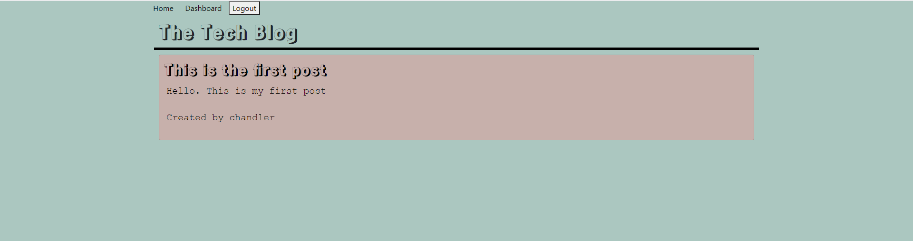

# Tech Blog

A blog application for authenticated users. Authenticated users can create/update and comment blogs.

## Live

[Live link](https://techblog-chand.herokuapp.com/)

### Homepage



### Dashboard


### Login


## User Story

```md
AS A developer who writes about tech
I WANT a CMS-style blog site
SO THAT I can publish articles, blog posts, and my thoughts and opinions
```

## If checked out

Must have a .env file that contains the following:

>DB_USER=
>DB_PW=
>DB_NAME='blog_db'

`npm install` to install dependencies.

`npm run seed` to seed example database.

`npm start` to start the server

## Technology Used

- Node
- Express
- Express Session
- Express Handlebars
- Sequelize
- dotenv
- bcrypt
- Handlebars

## License

[License](./LICENSE)